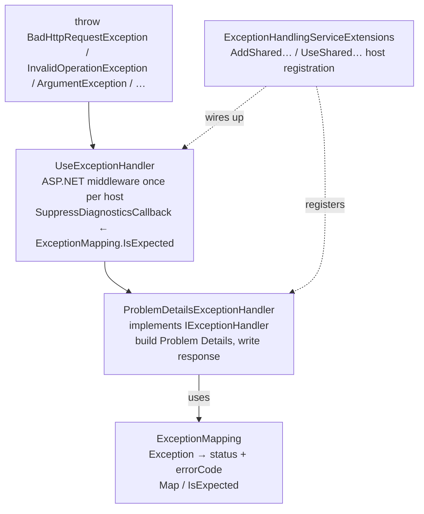

# Part 5 — Exceptions: the other channel

Parts 1–4 kept **expected** failures on the Result channel (`ErrorOr` → `Match*` → `ToProblem`). No `try/catch` in Product endpoints for not-found or validation.

This part answers: **what still throws**, and how **one** shared handler turns those exceptions into the **same** Problem Details shape clients already know from part 3.

MyApp today has **no Domain layer** and **no** typed “business” exceptions in Common. Validation, not-found, and conflicts already go through `ErrorOr`. The exception channel only catches what still escapes as `throw`.

If a request returns 500 from a bug, or malformed JSON returns 400 without hitting a handler, start here.

**Folder split in Common:**

| Folder | Channel | Contents |
|---|---|---|
| `Shared.Common/Errors/` (+ `Http/`) | Result | `Error`, `ErrorOr`, `ToProblem`, `Match*` |
| `Shared.Common/Exceptions/Http/` | Exception | `ExceptionMapping`, `ProblemDetailsExceptionHandler`, registration |

There is **no** `ConcurrencyException` (or similar) in Common. Optimistic concurrency, if you need it later, belongs in the host/infra that owns EF — or as `Error.Conflict` on the Result channel. `TransactionBehavior` in MyApp is a **demo** Unit-of-Work wrapper: rollback + rethrow only.

---

## 1. Architecture: what these files are for



| File | What it is for | What it is *not* for |
|---|---|---|
| [`ExceptionMapping.cs`](../../src/Shared/Common/Exceptions/Http/ExceptionMapping.cs) | Map exception type → HTTP status + stable `errorCode`; decide if diagnostics should be suppressed | Building JSON bodies; EF types |
| [`ProblemDetailsExceptionHandler.cs`](../../src/Shared/Common/Exceptions/Http/ProblemDetailsExceptionHandler.cs) | Implement `IExceptionHandler`: turn a thrown exception into Problem Details | Handling `ErrorOr` failures (those never throw) |
| [`ExceptionHandlingServiceExtensions.cs`](../../src/Shared/Common/Exceptions/Http/ExceptionHandlingServiceExtensions.cs) | One-liner host registration (`Add` / `Use`) | Per-feature policy |

**Why the handler lives in `Shared.Common/Exceptions`, not in `MyApp.Api`:**

| Location | Verdict | Why |
|---|---|---|
| `Shared.Common/Exceptions/Http` | **Preferred** | One contract for modular hosts + future microservices; kept separate from Result (`Errors/`) |
| `MyApp.Api/Presentation` only | Host-local copy | Becomes copy-paste with a second ASP.NET host |
| Per-feature module | Avoid | Modules return `ErrorOr` or let unexpected exceptions bubble; they do not own global HTTP policy |

---

## 2. What is `IExceptionHandler`?

`IExceptionHandler` is an ASP.NET Core interface (namespace `Microsoft.AspNetCore.Diagnostics`) — the modern way to plug into `UseExceptionHandler`.

```csharp
public interface IExceptionHandler
{
    ValueTask<bool> TryHandleAsync(
        HttpContext httpContext,
        Exception exception,
        CancellationToken cancellationToken);
}
```

| Piece | Meaning |
|---|---|
| **Who calls it?** | The exception-handler middleware, after an unhandled exception escapes the endpoint/pipeline |
| **`TryHandleAsync` returns `true`** | “I handled it” — response is (or will be) written; middleware stops looking for other handlers |
| **Returns `false`** | “Not mine” — next registered `IExceptionHandler` may try (MyApp has one handler that always handles or swallows cancel) |
| **Registration** | `services.AddExceptionHandler<ProblemDetailsExceptionHandler>()` then `app.UseExceptionHandler(...)` |

**How it differs from try/catch in every endpoint**

| Approach | Problem |
|---|---|
| `try/catch` in each Carter module | Copy-paste; easy to forget; inconsistent bodies |
| One `IExceptionHandler` | Single place for status, redaction, `traceId`, logging policy |

**How it differs from Result / `ToProblem` (part 3)**

| | Result channel | Exception channel (`IExceptionHandler`) |
|---|---|---|
| Trigger | Handler returns `ErrorOr` failure | Something **threw** |
| Your feature code | `return Error.NotFound(...)` | Usually nothing — let it bubble |
| HTTP builder | `ErrorExtensions.ToProblem` | `ProblemDetailsExceptionHandler` |
| Same wire shape? | Yes — RFC 9457 Problem Details | Yes |

MyApp’s `ProblemDetailsExceptionHandler` **is** that `IExceptionHandler` implementation. You almost never implement a second one unless you have a specialized host.

---

## 3. What belongs on the exception channel *today*

| Kind | Example | How MyApp treats it |
|---|---|---|
| Aborted request | Client navigated away | Swallow when `RequestAborted` — not an incident |
| Bad HTTP binding | Malformed JSON (`BadHttpRequestException`) | 400 Problem Details, code `BAD_REQUEST` |
| Programmer mistakes | `ArgumentException`, NRE, bug | **500** — not 400 (user input already filtered by FluentValidation) |
| Everything else unexpected | Timeout, unknown, EF concurrency if it bubbles | 500, hide detail outside Development |

**State conflicts that are expected API outcomes** use the Result channel: `return Error.Conflict(...)` → part 3 → 409. Do **not** invent `NotFoundException` / `ValidationException` / `ConflictException` / `ConcurrencyException` for those.

---

## 4. Full code — `ExceptionMapping.cs`

**Reminder (§1):** this file is the table. It does not write the response body.

Live path: `Shared.Common/Exceptions/Http/ExceptionMapping.cs`.

```csharp
using Microsoft.AspNetCore.Http;

namespace Shared.Common.Exceptions.Http;

public static class ExceptionMapping
{
    public static (int Status, string Code) Map(Exception ex) => ex switch
    {
        BadHttpRequestException e => (e.StatusCode, "BAD_REQUEST"),
        OperationCanceledException => (499, "REQUEST_ABORTED"),
        _ => (StatusCodes.Status500InternalServerError, "INTERNAL_ERROR"),
    };

    /// <summary>
    /// When true, .NET 10 <c>UseExceptionHandler</c> suppresses UnhandledException diagnostics.
    /// </summary>
    public static bool IsExpected(Exception ex)
        => ex is OperationCanceledException
           || Map(ex).Status is >= 400 and < 500;
}
```

### How it works

* **`Map`** — small switch: known framework/client exceptions → status + code; everything else → 500 `INTERNAL_ERROR`.
* **`IsExpected`** — when `true`, `UseExceptionHandler` suppresses Error-level *UnhandledException* diagnostics (client abort, bad request). True 500s still raise diagnostics.

**Why `ArgumentException` → 500?** It falls in `_ → INTERNAL_ERROR`. Invalid arguments that reach a handler usually mean a programming bug. User-facing field mistakes already failed in part 4.

---

## 5. Full code — `ProblemDetailsExceptionHandler.cs` (`IExceptionHandler`)

**Reminder (§1–2):** this class **implements** `IExceptionHandler`. It is the exception channel’s counterpart to part 3’s `ToProblem`.

Live path: `Shared.Common/Exceptions/Http/ProblemDetailsExceptionHandler.cs`.

```csharp
using Microsoft.AspNetCore.Diagnostics;
using Microsoft.AspNetCore.Http;
using Microsoft.AspNetCore.Mvc;
using Microsoft.AspNetCore.WebUtilities;
using Microsoft.Extensions.Hosting;
using Microsoft.Extensions.Logging;

namespace Shared.Common.Exceptions.Http;

public sealed class ProblemDetailsExceptionHandler(
    IProblemDetailsService problems,
    ILogger<ProblemDetailsExceptionHandler> log,
    IHostEnvironment env) : IExceptionHandler
{
    public async ValueTask<bool> TryHandleAsync(
        HttpContext ctx,
        Exception ex,
        CancellationToken ct)
    {
        if (ex is OperationCanceledException && ctx.RequestAborted.IsCancellationRequested)
            return true;

        var (status, code) = ExceptionMapping.Map(ex);
        if (status < 500)
            log.LogWarning(ex, "Handled {Code} on {Path}", code, ctx.Request.Path);

        var problem = new ProblemDetails
        {
            Status = status,
            Title = ReasonPhrases.GetReasonPhrase(status),
            Type = $"https://httpstatuses.io/{status}",
            Instance = ctx.Request.Path,
            Detail = status >= 500 && !env.IsDevelopment()
                ? "An unexpected error occurred."
                : ex.Message,
        };
        problem.Extensions["traceId"] = ctx.TraceIdentifier;
        problem.Extensions["errorCode"] = code;

        ctx.Response.StatusCode = status;
        return await problems.TryWriteAsync(new ProblemDetailsContext
        {
            HttpContext = ctx,
            Exception = ex,
            ProblemDetails = problem,
        });
    }
}
```

### How it works (step by step)

1. **Client gone** (`OperationCanceledException` + `RequestAborted`) → return `true` with no body.
2. **`ExceptionMapping.Map`** → status + code.
3. **Status &lt; 500** → `LogWarning`. 500s rely on unhandled diagnostics when not suppressed.
4. **Build `ProblemDetails`** — same fields as part 3.
5. **5xx redaction** — outside Development, generic `Detail`.
6. **Extensions** — `traceId`, `errorCode`.
7. **`IProblemDetailsService.TryWriteAsync`** — honors `CustomizeProblemDetails`.

Feature endpoints still have **no** `try/catch` for these cases — the middleware invokes this handler once.

---

## 6. Full code — host registration helpers

Live path: `Shared.Common/Exceptions/Http/ExceptionHandlingServiceExtensions.cs`.

```csharp
using Microsoft.AspNetCore.Builder;
using Microsoft.Extensions.DependencyInjection;

namespace Shared.Common.Exceptions.Http;

public static class ExceptionHandlingServiceExtensions
{
    public static IServiceCollection AddSharedExceptionHandling(this IServiceCollection services)
    {
        services.AddProblemDetails(options =>
        {
            options.CustomizeProblemDetails = ctx =>
                ctx.ProblemDetails.Extensions.TryAdd("traceId", ctx.HttpContext.TraceIdentifier);
        });
        services.AddExceptionHandler<ProblemDetailsExceptionHandler>();
        return services;
    }

    public static WebApplication UseSharedExceptionHandling(this WebApplication app)
    {
        app.UseExceptionHandler(new ExceptionHandlerOptions
        {
            SuppressDiagnosticsCallback = ctx => ExceptionMapping.IsExpected(ctx.Exception),
        });
        app.UseStatusCodePages();
        return app;
    }
}
```

### What the host actually calls

```csharp
services.AddSharedExceptionHandling();
app.UseSharedExceptionHandling();
```

---

## 7. End-to-end: throw vs result

| Request | Channel | Outcome |
|---|---|---|
| `GET /_diag/result/not-found` | Result | 404 Problem Details, no exception logs |
| `GET /_diag/result/conflict` | Result | 409 via `Error.Conflict` (not an exception) |
| `GET /_diag/throw/unexpected` | Exception | 500, generic detail in Testing/Production, diagnostics **kept** |
| `GET /_diag/throw/argument` | Exception | 500 `INTERNAL_ERROR` |
| `POST …` malformed JSON | Exception (`BadHttpRequestException`) | 400 `BAD_REQUEST` |

```text
GET /_diag/throw/unexpected
  → endpoint throws InvalidOperationException
  → UseExceptionHandler → IExceptionHandler.TryHandleAsync
  → ExceptionMapping.Map → (500, INTERNAL_ERROR)
  → Problem Details (detail redacted outside Development)
```

Throw kinds today: `unexpected`, `argument` only.

Part 9 teaches you how to assert these with tests.

---

## 8. Optional: DDD adaptations (not implemented)

When you add aggregates that throw typed domain exceptions:

1. Prefer catching at the **handler** boundary and converting to `Error.Conflict(code, message)` so endpoints stay on the Result → HTTP path.
2. Optionally extend `ExceptionMapping` as a safety net — still prefer handler translation.
3. Do **not** let routine invariant breaches become 500s.

Until Domain exists, skip this section in day-to-day work.

---

## Checkpoint

* [ ] You can explain **what `IExceptionHandler` is** and how `ProblemDetailsExceptionHandler` implements it.
* [ ] You know Result lives under `Errors/`, exception handling under `Exceptions/Http/`.
* [ ] Expected conflicts use `Error.Conflict`, not a concurrency exception type.
* [ ] You can explain `IsExpected` and why `ArgumentException` is 500.
* [ ] You know `/_diag/throw/*` exercises unexpected / argument throws only.

**Next:** [part9and10.md](part9and10.md) — prove the design with unit, behavior, and integration tests, then a build-it-yourself checklist.
